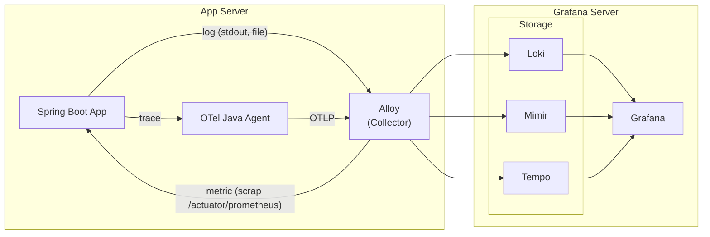

# LGTM Practice

## 🏗️ Architecture

```mermaid
flowchart LR
%% =======================
%% App Server
%% =======================
    subgraph APP_SERVER["App Server"]
        APP["Spring Boot App"]
        AGENT["OTel Java Agent"]
        ALLOY["Alloy <br> (Collector)"]
    end

%% =======================
%% Grafana Server
%% =======================
    subgraph GRAFANA_SERVER["Grafana Server"]
        subgraph STORAGE["Storage"]
            LOKI["Loki"]
            MIMIR["Mimir"]
            TEMPO["Tempo"]
        end

        GRAFANA["Grafana"]
    end

%% =======================
%% 연결
%% =======================
    APP -- "log (stdout, file)" --> ALLOY
    APP -- trace --> AGENT
    ALLOY -- "metric (scrap /actuator/prometheus)" --> APP
    AGENT -- "OTLP" --> ALLOY
    ALLOY --> LOKI
    ALLOY --> MIMIR
    ALLOY --> TEMPO
    LOKI --> GRAFANA
    MIMIR --> GRAFANA
    TEMPO --> GRAFANA
```

## 🚀 실행

## 📌️ 참고

### agent download
[opentelemetry-java-instrumentation](https://github.com/open-telemetry/opentelemetry-java-instrumentation)

